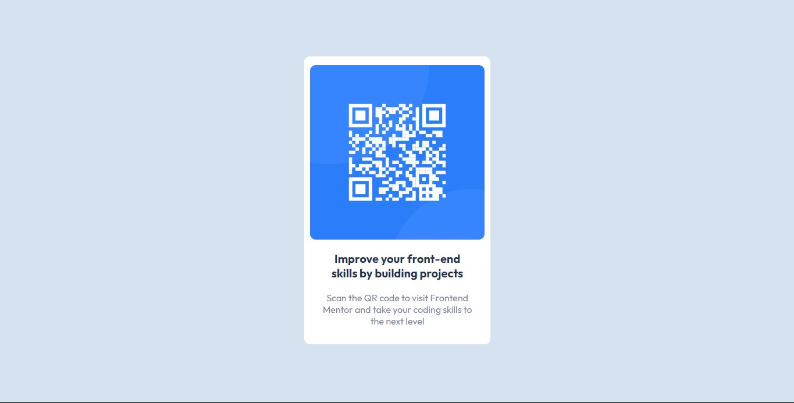

# Frontend Mentor - QR code component solution

Esta é uma solução para o desafio [QR code component challenge on Frontend Mentor](https://www.frontendmentor.io/challenges/qr-code-component-iux_sIO_H). Os desafios do Frontend Mentor ajudam você a melhorar suas habilidades de codificação criando projetos realistas.

### 🔗 Links 

- [Solução no Frontend Mentor](https://www.frontendmentor.io/solutions/social-proof-section-using-grid-and-flex-C-YcWS7Ddc)

- [Deployment no Github Pages](https://fransuelton.github.io/qr-code-component/)

### ✨ Tecnologias Utilziadas

- Marcação semântica HTML5
- CSS
- Flexbox

### 🙋 Autor

- Perfil no Linkedin - [Acesse aqui.](https://www.linkedin.com/in/fransuelton/)
- Página no Frontend Mentor - [Acesse aqui.](https://www.frontendmentor.io/profile/Fransuelton)